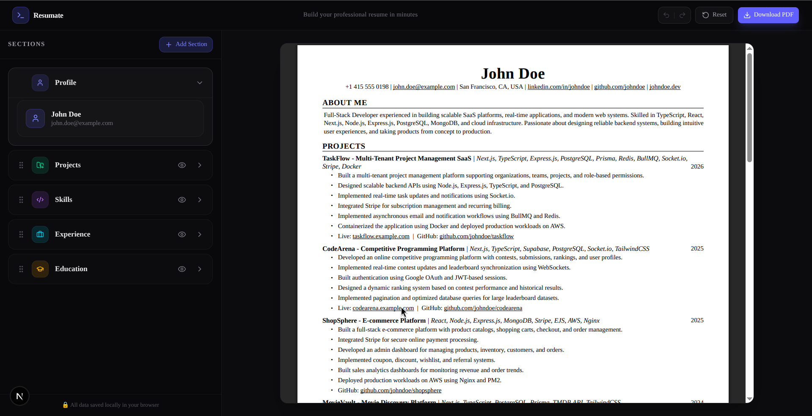
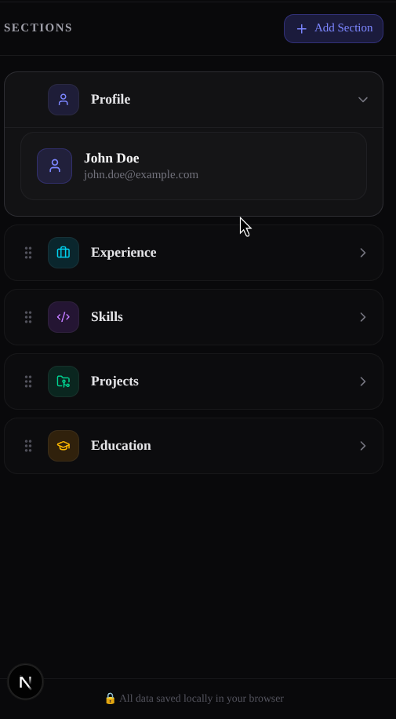

<div align="center">

# 📄 Resumate

**A modern, minimalist LaTeX-styled resume builder with real-time PDF rendering and seamless drag-and-drop customization.**

[](https://nextjs.org/)
[](https://react.dev/)
[](https://www.typescriptlang.org/)
[](https://tailwindcss.com/)
[](https://react-pdf.org/)
[](https://opensource.org/licenses/MIT)

<br />



</div>

---

## 🌟 Key Features

### 📐 Exact Jake's Resume LaTeX Aesthetic
- Modeled after the industry-standard **Jake's Resume** LaTeX template.
- Clean typography using standard **Times-Roman** serif fonts, solid horizontal dividers, aligned dates/locations, and tight bullet spacing optimized for ATS (Applicant Tracking Systems).

### 🔀 Smooth Drag-and-Drop Reordering
- Powered by `@dnd-kit/core` and `@dnd-kit/sortable`.
- Reorder **Experience**, **Skills**, **Projects**, and **Education** effortlessly.
- **Profile is pinned** at index 0 to ensure contact details always remain at the top.
- **Touch-Optimized for Mobile**: Includes a 200ms touch activation delay and isolated drag handles with `touch-action: none` so page scrolling remains butter-smooth on mobile devices.

### 👁️ Hide & Archive Sections
- Need to hide your Experience section (e.g. for a fresh graduate) or omit Projects?
- Click the **Eye icon** on any section to hide it from the active list and PDF.
- Hidden sections are neatly moved into an **Archived Sections** panel with a 1-click **Unhide** button to restore them whenever needed.

### ↺ Time-Travel Undo & Redo
- Full state history tracking across all user actions: text input, section reordering, visibility toggling, and demo resets.
- **Smart Keystroke Debouncing**: Rapid continuous typing updates the screen immediately without flooding the undo stack, while pauses commit new snapshots.
- **Global Keyboard Shortcuts**:
  - **Undo**: <kbd>Ctrl</kbd> + <kbd>Z</kbd> (or <kbd>Cmd</kbd> + <kbd>Z</kbd> on macOS)
  - **Redo**: <kbd>Ctrl</kbd> + <kbd>Y</kbd> or <kbd>Ctrl</kbd> + <kbd>Shift</kbd> + <kbd>Z</kbd> (or <kbd>Cmd</kbd> + <kbd>Shift</kbd> + <kbd>Z</kbd> on macOS)

### 🔄 Reset to Demo Data
- Built-in reset button in the header to revert back to sample demo data (*John Doe*).
- Protected by a **responsive confirmation modal** explaining exactly what will be restored, preventing accidental data loss.

### ⚡ Dual-Mode Real-Time Preview
- **Desktop**: Real-time native PDF viewer powered by `@react-pdf/renderer` with instant re-rendering upon data or order changes.
- **Mobile**: 1:1 responsive HTML/CSS paper preview that loads instantly across iOS Safari and Android Chrome without requiring PDF browser plugins.

### 📥 One-Click PDF Export
- Export clean, high-resolution vector PDFs generated entirely client-side.
- Automatically filenames files based on your profile name (e.g. `John_Doe_Resume.pdf`).

### 🔒 100% Privacy & Local Storage
- All resume content is saved automatically to your browser's `localStorage`.
- No backend tracking, no account registration, and no cloud uploads — your private career data never leaves your computer.

---

## 📱 Mobile & Desktop Screenshots

| Desktop Builder & PDF Preview | Mobile Sections Editor |
| :---: | :---: |
|  |  |

---

## 🛠️ Tech Stack

| Technology | Purpose |
| :--- | :--- |
| **[Next.js 16 (App Router)](https://nextjs.org/)** | React Framework with Turbopack |
| **[React 19](https://react.dev/)** | Frontend UI Library |
| **[TypeScript](https://www.typescriptlang.org/)** | Type Safety & Developer Experience |
| **[Tailwind CSS v4](https://tailwindcss.com/)** | Styling & Theme System |
| **[@react-pdf/renderer](https://react-pdf.org/)** | Programmatic PDF document generation |
| **[@dnd-kit](https://dndkit.com/)** | Accessible drag-and-drop toolkit |
| **[@base-ui/react](https://base-ui.com/)** | Unstyled, accessible UI primitives (Dialog, Popups) |
| **[Lucide Icons](https://lucide.dev/)** | UI Icons |

---

## 🚀 Getting Started

### Prerequisites

Ensure you have **Node.js 18.17+** or later installed on your system. **[pnpm](https://pnpm.io/)** is recommended:

```bash
node -v
pnpm -v
```

### Installation

1. **Clone the repository:**
   ```bash
   git clone https://github.com/gkl-me/resumate.git
   cd resumate
   ```

2. **Install dependencies:**
   ```bash
   pnpm install
   # or
   npm install
   ```

3. **Start the development server:**
   ```bash
   pnpm dev
   # or
   npm run dev
   ```

4. **Open your browser:**
   Navigate to [http://localhost:3000/builder](http://localhost:3000/builder) to start creating your resume.

---

## 📦 Building for Production

To create an optimized production build:

```bash
pnpm build
pnpm start
```

---

## ⌨️ Keyboard Shortcuts

| Shortcut | Action |
| :--- | :--- |
| <kbd>Ctrl</kbd> + <kbd>Z</kbd> / <kbd>Cmd</kbd> + <kbd>Z</kbd> | **Undo** last change |
| <kbd>Ctrl</kbd> + <kbd>Y</kbd> / <kbd>Cmd</kbd> + <kbd>Shift</kbd> + <kbd>Z</kbd> | **Redo** undone change |

---

## 📂 Project Structure

```
resumate/
├── app/
│   ├── builder/            # Main builder page layout & tabs
│   ├── data/               # Resume type definitions & default demo dataset
│   ├── layout.tsx          # Root layout & font definitions
│   └── page.tsx            # Landing page
├── components/
│   ├── builder/
│   │   ├── AddSectionModal.tsx     # Add new sections modal dialog
│   │   ├── BuilderHeader.tsx       # Header with Undo/Redo, Reset & PDF Export
│   │   ├── ResetConfirmModal.tsx   # Reset confirmation modal
│   │   ├── ResumePreview.tsx       # Mobile 1:1 HTML/CSS paper preview
│   │   ├── SectionList.tsx         # Drag-and-drop sortable section accordions
│   │   └── *Section.tsx            # Form editors (Profile, Experience, etc.)
│   ├── pdf/
│   │   ├── PdfPreviewPanel.tsx     # PDF viewer container
│   │   └── ResumePdfDocument.tsx   # Jake's Resume LaTeX PDF Document
│   └── ui/                         # Base UI & Radix-style component primitives
├── hooks/
│   └── useResumeStore.ts   # Centralized resume state with undo/redo & local storage
├── public/
│   └── screenshots/        # Application preview images
└── package.json
```

---

## 📄 License

This project is licensed under the MIT License — see the [LICENSE](LICENSE) file for details.
